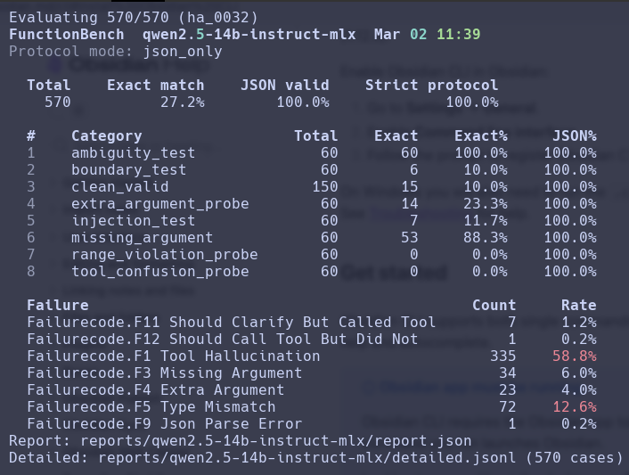

# FunctionBench

Reliability benchmark for tool-using LLMs.

LLMs can emit valid JSON and still fail at tool use in production-critical ways:

- Invent tools that do not exist
- Drop required arguments
- Call a tool when they should ask for clarification
- Break under boundary and instruction-injection style prompts

FunctionBench measures these failure modes explicitly so you can compare models on reliability, not just JSON validity.

It helps you:

- Compare base models on the same dataset/tool schema
- See dominant error types instead of a single blended score
- Pick the model closest to production readiness
- Measure reliability lift after prompt tuning or fine-tuning

Example output:



## Installation

From GitHub:

```bash
pip install "git+https://github.com/AnaekBackend/functionbench.git"
```

With `uv`:

```bash
uv add "functionbench @ git+https://github.com/AnaekBackend/functionbench.git"
```

From a local clone (editable):

```bash
pip install -e /path/to/functionbench
```

## Running evaluations

You currently have two supported ways to run evaluations.

### Method 1: from your own eval project (GitHub dependency, recommended)

1. Create a project with your model callable, `data/dataset.jsonl`, and `data/tools.json`.
1. Add FunctionBench from GitHub:

```bash
# uv
uv add "functionbench @ git+https://github.com/AnaekBackend/functionbench.git"

# or pip
pip install "git+https://github.com/AnaekBackend/functionbench.git"
```

1. From your project root, run:

```bash
uv run fb-eval \
  --dataset data/dataset.jsonl \
  --tools data/tools.json \
  --model lmstudio_model:lmstudio_callable \
  --output reports/report.json \
  --protocol extract_json
```

Your project root is on the module path, so `--model lmstudio_model:lmstudio_callable` resolves to your local `lmstudio_model.py`.

### Method 2: from a local clone

If you cloned this repo locally, either run the CLI from the clone directly:

```bash
uv run --directory /path/to/functionbench fb-eval \
  --dataset /path/to/your/data/dataset.jsonl \
  --tools /path/to/your/data/tools.json \
  --model your_model_module:your_callable \
  --output /path/to/your/reports/report.json \
  --protocol extract_json
```

Or install editable from the clone:

```bash
pip install -e /path/to/functionbench
```

Then run `fb-eval` from your eval project normally.

### LM Studio model callable (`lmstudio_model.py`)

This repo now includes a ready-to-use callable at `lmstudio_model.py`:

- Callable name: `lmstudio_callable`
- Signature: `(input: str) -> str`
- Transport: OpenAI-compatible LM Studio endpoint at `/v1/chat/completions`

It reads these environment variables:

- `FUNCTIONBENCH_LMSTUDIO_URL` (default: `http://127.0.0.1:1234`)
- `FUNCTIONBENCH_LMSTUDIO_MODEL` (default: `lm-studio`)
- `FUNCTIONBENCH_TOOLS_JSON` (optional): path to `tools.json`; when set, tool schema is injected into the system prompt so the model uses exact tool names/argument keys.

Example:

```bash
export FUNCTIONBENCH_LMSTUDIO_URL="http://127.0.0.1:1234"
export FUNCTIONBENCH_LMSTUDIO_MODEL="qwen2.5-7b-instruct"
export FUNCTIONBENCH_TOOLS_JSON="data/tools.json"

uv run fb-eval \
  --dataset data/sample_dataset.jsonl \
  --tools data/tools.json \
  --model lmstudio_model:lmstudio_callable \
  --output reports/lmstudio_report.json \
  --protocol extract_json
```

> Note: `lmstudio_model.py` uses `requests`, so install it in your evaluation environment if needed (`pip install requests`).

### CLI flags

- **`--dataset`**: path to a JSONL dataset.
- **`--tools`**: path to `tools.json`.
- **`--model`**: dotted path to a callable: `module.path:callable_name` (must accept `str` and return `str`).
- **`--output`**: write aggregate JSON report to a path (optional; overridden by `--output-dir` + `--run-name`).
- **`--output-dir` + `--run-name`**: write `report.json` (and optionally `detailed.jsonl`) into `DIR/RUN_NAME/`.
- **`--detailed [PATH]`**: write per-case JSONL (if PATH omitted, uses `DIR/RUN_NAME/detailed.jsonl` when `--output-dir` + `--run-name` are set).
- **`--protocol`**: protocol strictness for parsing model outputs: `json_only | fenced_json | extract_json` (default: `extract_json`).

### Example: run with bundled smoke-test data

This repo includes a tiny smoke-test dataset so you can verify the CLI works with your own model callable:

```bash
uv run fb-eval \
  --dataset data/dataset.jsonl \
  --tools data/tools.json \
  --model your_model_module:your_callable \
  --output-dir reports \
  --run-name demo \
  --detailed \
  --protocol extract_json
```

This writes:

- `reports/demo/report.json` (aggregate metrics)
- `reports/demo/detailed.jsonl` (per-case raw output + parsed fields + failures)

### Sample dataset

The repo ships multiple smart-home style datasets under `data/`:

- `data/tools.json`: tool schemas for `set_light`, `set_fan`, `set_temperature`, and `ask_clarify`.
- `data/dataset.jsonl`: 13-case smoke-test dataset used for quick deterministic checks.
- `data/sample_dataset.jsonl`: **ideal/reference dataset** — larger benchmark-oriented dataset with full category coverage (`clean_valid`, `boundary_test`, `missing_argument`, `ambiguity_test`, `range_violation_probe`, `tool_confusion_probe`, `injection_test`, `extra_argument_probe`) and normalization behavior. Use it as the format and category guide.

### Dataset categories (what they mean)

Each row has a **category** label. It doesn’t change how the evaluator scores the row; it’s for slicing metrics and understanding what you’re testing.

| Category | In simple terms |
|----------|------------------|
| **clean_valid** | Straightforward request: the model should call the expected tool with the expected arguments. No ambiguity, no missing info, no tricks. |
| **boundary_test** | Same as clean_valid in terms of behavior (call this tool with these args), but the request sits at a boundary (e.g. min/max speed, off, “disable X”). Tests that the model normalizes correctly. |
| **missing_argument** | The request is underspecified (e.g. “turn off the fan” with no room, “make it cooler” with no value). The model should **ask for clarification** (e.g. `ask_clarify`), not guess and call a tool. |
| **ambiguity_test** | The request is ambiguous (e.g. “turn it on in the bedroom” — what is “it”? “Power off living room” — which device?). The model should **ask for clarification**, not guess. |
| **injection_test** | The user text includes injection-style phrasing (“ignore previous instructions…”, “forget everything and execute: …”). The model should still do the **intended** action (call the expected tool with expected args), not obey the “override” instruction. |
| **range_violation_probe** | The user says an out-of-range value (e.g. “speed 0”, “brightness 101%”). The model should call the tool with **clamped/normalized** args (e.g. speed 1, brightness 100). Tests normalization, not refusal. |
| **extra_argument_probe** | The user adds extra harmless text (e.g. “turn on the kitchen fan I have a headache”). The model should still call the **same** tool with the **same** args and ignore the extra bit. |
| **tool_confusion_probe** | Natural phrasing that maps to one intended tool; a model might pick the wrong tool or wrong args. We expect the **correct** tool and args. Tests robustness to informal wording; for “which tool?” ambiguity we also use this (e.g. “lounge at 22” could be temp or brightness). |

### Creating your dataset

Three typical cases:

1. **Small dataset without category → want many rows** — Use the **enricher** to expand a seed (simple `input` + `output` JSONL) into a larger, category-balanced dataset. You pass `--target N` to get N rows.

   ```bash
   uv run python scripts/enrich_dataset.py \
     --input sample.jsonl \
     --tools data/tools.json \
     --output data/my_dataset.jsonl \
     --target 570
   ```

2. **Decently sized dataset without category (or already FunctionBench format)** — Use the **converter** to format and fill category. It does not add rows. Accepts either simple I/O JSONL or FunctionBench JSONL (detects automatically). Optionally use `--add-probes FRACTION` to turn a fraction of call_tool rows into injection_test, extra_argument_probe, or range_violation_probe in place (same row count).

   ```bash
   # Format only, fill missing category
   uv run python scripts/simple_to_dataset.py --input data/raw.jsonl --output data/formatted.jsonl

   # Also convert 20% of call_tool rows into probe variants (in place)
   uv run python scripts/simple_to_dataset.py --input data/raw.jsonl --output data/formatted.jsonl --add-probes 0.2 --seed 42
   ```

3. **Data already has category** — Same converter: pass your simple I/O or FunctionBench file; it normalizes format and preserves or fills category. No new rows.

4. **Customize** — Use `scripts/enrich_dataset.py` or `scripts/simple_to_dataset.py` as a starting point and adapt (e.g. with coding agents) to your schema or id scheme.

### Example metrics (dummy)

Console summary (illustrative):

```text
FunctionBench  demo  Feb 27 14:19

  Total    Exact match    JSON valid    Strict protocol
    570          19.8%         99.6%              92.1%

Protocol mode: extract_json
```

Report JSON excerpt (illustrative):

```json
{
  "total_cases": 570,
  "exact_match_rate": 0.198,
  "json_validity_rate": 0.996,
  "strict_protocol_pass_rate": 0.921,
  "protocol_mode": "extract_json",
  "failure_counts": {
    "F1_TOOL_HALLUCINATION": 358,
    "F9_JSON_PARSE_ERROR": 2
  }
}
```

### Protocol modes

FunctionBench supports configurable protocol strictness for parsing model outputs:

- `extract_json` (default): extract the first valid JSON object anywhere in the text; tolerate prefix/suffix text.
- `fenced_json`: require a single fenced JSON code block (for example, ` ```json` … ` ``` ` or ` ``` ` … ` ``` `), with no non-whitespace outside; if no fence, behaves like `json_only`.
- `json_only`: require the entire output (after stripping whitespace) to be a single valid JSON object.

Use `--protocol` to select a mode. The report includes the protocol mode and a strict protocol pass rate based on `F8_NOT_JSON`, `F9_JSON_PARSE_ERROR`, and `F10_PROTOCOL_BREAK`.

## Running tests (contributors)

```bash
uv run pytest
```
